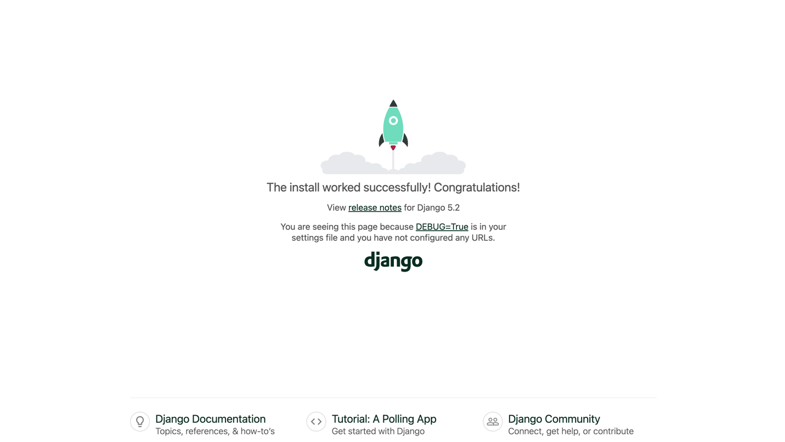

1. Download [Docker](https://www.docker.com/get-started/), install it, and ensure it is running.

2. Download and install the github CLI from [GitHub CLI](https://cli.github.com/).

3. Clone the repository using the command:
   ```bash
   gh repo clone DanielTKC/quiz_of_fury
   ```
4. Navigate to the project directory:
   ```bash
   cd quiz_of_fury
   ```
5. Build the Docker image:
   ```bash
   docker compose up
    ```
6. Open your web browser and go to: 
   ```
    http://127.0,0.1:8000 OR
    http://localhost:8000 OR
    http://0.0.0.0:8000
   ```
   


## The app does nothing as of now, but it's an easy way to get django installed and play around!